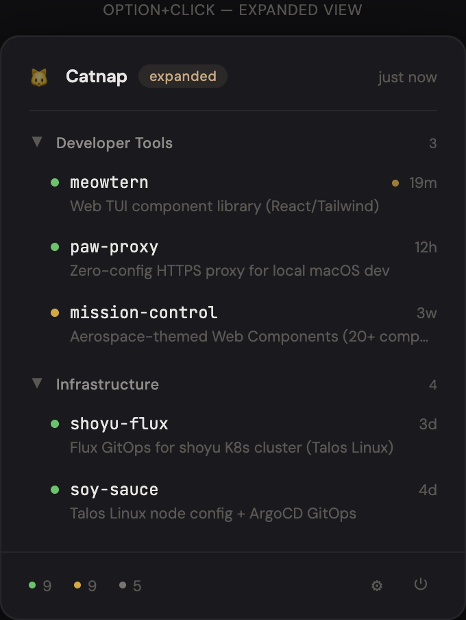
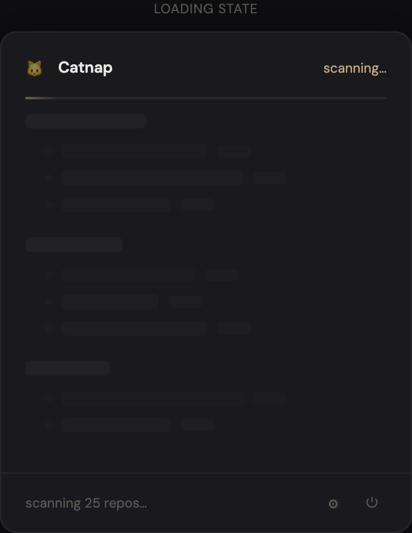

# Catnap

macOS menubar dashboard for your local git repos. Scans a directory, shows live status, and enriches with GitHub data.

> **Personal project.** I built this because I have too many repos and kept losing track of what's active. It scratches my own itch. Maintenance will be sporadic — I fix things when I need them. Contributions are welcome but response times may vary.


## Features

- **Click** the cat icon for a compact repo list — status dot, name, dirty indicator, relative time
- **Option+Click** for expanded view with GitHub descriptions
- **Click any repo** to open it on GitHub
- Collapsible category sections with persisted state
- Background polling (configurable interval)
- Skeleton loading state with shimmer animation
- GitHub description caching (refreshes daily)
- Settings popover for scan path, thresholds, and refresh interval

## Views

| Compact | Expanded | Loading |
|---------|----------|---------|
|  |  |  |

## Prerequisites

| Dependency | Required | Purpose | Install |
|------------|----------|---------|---------|
| **macOS 14+** (Sonoma) | Yes | MenuBarExtra `.window` style, Observation framework | — |
| **Swift 6** | Yes | Build from source | Comes with Xcode 16+ or `xcode-select --install` |
| **git** | Yes | Repo scanning (`/usr/bin/git`) | Ships with macOS CLI tools |
| **gh** (GitHub CLI) | No | GitHub description enrichment | `brew install gh` then `gh auth login` |

The app uses absolute paths to binaries since `.app` bundles don't inherit shell PATH. It searches `/opt/homebrew/bin/gh` (Apple Silicon) and `/usr/local/bin/gh` (Intel) automatically.

## Install

```bash
brew install --cask alexcatdad/tap/catnap
```

Or build from source:

```bash
git clone https://github.com/alexcatdad/catnap.git
cd catnap
make run
```

### Make Targets

```bash
make run     # build + bundle + codesign + open
make build   # swift build only
make clean   # remove .build and .app
```

### Quit

Via the power button in the popup footer, or `pkill Catnap`.

### Launch at Login

Add `Catnap.app` to **System Settings > General > Login Items**.

## Configuration

Config lives at `~/.config/catnap/config.json`. Created with defaults on first run, or editable via the gear icon in the popup.

```json
{
  "scanPath": "~/REPOS/alexcatdad",
  "githubOwner": "alexcatdad",
  "refreshIntervalMinutes": 5,
  "activeDays": 14,
  "staleDays": 60,
  "categories": {
    "Profile & Config": ["alexcatdad", "dotfiles", "paw"],
    "Developer Tools": ["paw-proxy", "meowtern"],
    "Infrastructure": ["shoyu-flux", "soy-sauce"]
  },
  "collapsedSections": []
}
```

| Field | Description |
|-------|-------------|
| `scanPath` | Directory to scan for git repos |
| `githubOwner` | GitHub username for repo links and `gh` enrichment |
| `refreshIntervalMinutes` | Background poll interval |
| `activeDays` | Repos with commits within N days are "active" (green) |
| `staleDays` | Repos with no commits for N days are "stale" (gray) |
| `categories` | Map of category names to repo name arrays |
| `collapsedSections` | Categories collapsed by default |

### Status Colors

- **Green** — active (commits within `activeDays`)
- **Gold** — in progress (between active and stale thresholds)
- **Gray** — stale (no commits for `staleDays`)

## Forking & Customization

This is designed to be forked and personalized. To make it your own:

1. **Fork the repo** and clone your fork
2. **Edit `~/.config/catnap/config.json`** — set your `scanPath` and `githubOwner`
3. **Define your categories** — group repos however makes sense for your workflow
4. **Adjust thresholds** — `activeDays` and `staleDays` control when repos change status
5. **`make run`** — that's it

The default config is hardcoded in `Sources/Models/AppConfig.swift` as a fallback. If you want to change the defaults for your fork, edit the `static let default` property there.

The app has no external Swift dependencies — just Foundation and SwiftUI. No CocoaPods, no SPM packages, no xcframeworks.

## Security

- **No network access.** The app never makes HTTP requests. GitHub enrichment is done by shelling out to the `gh` CLI, which handles its own authentication.
- **No sandbox.** The app runs unsigned (ad-hoc codesign) without App Sandbox. It needs filesystem access to scan repos and execute `git`/`gh`. This means it has the same permissions as any terminal command you run.
- **Shell execution.** The app runs `/usr/bin/git` and `/opt/homebrew/bin/gh` via `Foundation.Process`. Arguments are passed as arrays (not string interpolation), which prevents shell injection. However, repo paths from your config are passed as working directory arguments — don't point `scanPath` at untrusted directories.
- **Config and cache.** Stored in `~/.config/catnap/` as plain JSON. Contains no secrets — just paths, repo names, and GitHub descriptions. The `gh` CLI manages its own auth tokens separately.
- **No telemetry, analytics, or crash reporting.**

If you discover a security issue, please open an issue on GitHub or email directly rather than disclosing publicly.

## Stack

Swift 6 / SwiftUI / SPM / MenuBarExtra / Observation framework

## License

MIT
